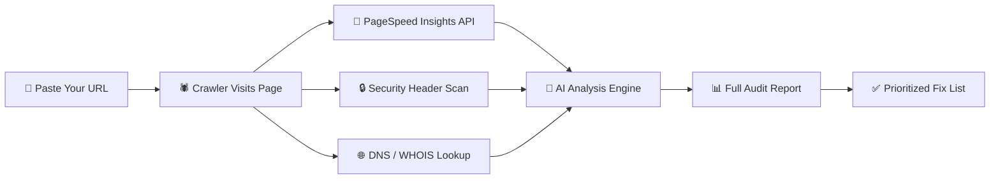

<div align="center">

[](https://freepagerank.com)

[](https://freepagerank.com)

<br/>

[](https://freepagerank.com)
&nbsp;
[](https://freepagerank.com)
&nbsp;
[](https://freepagerank.com)

<br/>


&nbsp;

&nbsp;

&nbsp;

&nbsp;


</div>

---

## 🔍 What is FreePageRank?

> **[FreePageRank.com](https://freepagerank.com)** is the most comprehensive **free SEO + AI Crawler audit tool** on the internet. Paste any URL and get a full technical health report in under 3 seconds — no account, no credit card, no strings.

We pull real data from **Google PageSpeed Insights** and a suite of crawlers, then transform raw technical signals into a clear, prioritized, human-readable report that any site owner can act on immediately.

```
╔══════════════════════════════════════════════════════════════════════╗
║  You paste:  https://yourwebsite.com                                ║
║                    ↓                                                ║
║  FreePageRank runs 80+ checks across 8 categories                  ║
║  → Performance · SEO · Accessibility · Security                     ║
║  → AI Crawler · Best Practices · DNS · Technology Stack             ║
║                    ↓                                                ║
║  You get:  Scores + Issues + Fix Instructions + AI Readiness        ║
║  Time:     < 3 seconds.   Cost: $0.                                 ║
╚══════════════════════════════════════════════════════════════════════╝
```

---

## ⚡ What We Audit

```
┌──────────────────────────────────────────────────────────────────────┐
│                    FREEPAGERANK AUDIT COVERAGE                       │
├─────────────────────────┬────────────────────────────────────────────┤
│  🔍 TECHNICAL SEO       │  Meta tags, canonical URLs, structured     │
│                         │  data, sitemaps, robots.txt, heading        │
│                         │  hierarchy, Open Graph, redirect chains     │
├─────────────────────────┼────────────────────────────────────────────┤
│  ⚡ CORE WEB VITALS     │  LCP, FCP, TBT, CLS, SI, TTFB with        │
│                         │  element-level attribution — know exactly  │
│                         │  WHICH element tanks your score            │
├─────────────────────────┼────────────────────────────────────────────┤
│  🤖 AI CRAWLER AUDIT    │  Simulate GPTBot, ClaudeBot & Perplexity  │
│                         │  See what AI models extract from your      │
│                         │  pages — a feature no one else offers      │
├─────────────────────────┼────────────────────────────────────────────┤
│  ♿ ACCESSIBILITY        │  WCAG compliance, ARIA labels, contrast    │
│                         │  ratios, keyboard navigation, alt text     │
├─────────────────────────┼────────────────────────────────────────────┤
│  🔒 SECURITY HEADERS    │  CSP, HSTS, X-Frame-Options, CORS,        │
│                         │  Referrer-Policy, Permissions-Policy       │
├─────────────────────────┼────────────────────────────────────────────┤
│  🧰 TECHNOLOGY STACK    │  CMS, frameworks, CDN, analytics tools,    │
│                         │  ad networks, tag managers detected        │
├─────────────────────────┼────────────────────────────────────────────┤
│  🌐 DNS & WHOIS         │  DNS records, DMARC, SPF, MX, HTTPS cert, │
│                         │  domain age, registrar, expiry date        │
├─────────────────────────┼────────────────────────────────────────────┤
│  📄 BEST PRACTICES      │  Image formats, lazy loading, console      │
│                         │  errors, deprecated APIs, HTTPS usage      │
└─────────────────────────┴────────────────────────────────────────────┘
```

---

## 🤖 The AI Crawler Audit — Our Signature Feature

AI-powered search is reshaping how content gets discovered. ChatGPT, Perplexity, and Google's AI Overviews now drive millions of visits per day. **FreePageRank is the only free tool that shows you exactly how AI crawlers see your site.**

```
▸ freepagerank.com/audit → yoursite.com
──────────────────────────────────────────────────────
00:00.1  → GPTBot/1.1  initializing connection
00:00.3  ✓  robots.txt — AI crawlers ALLOWED
00:00.5  ✓  HTML parsed — semantic structure: GOOD
00:00.9  ⚠  Schema.org: PARTIAL (Article type missing)
00:01.1  ✓  Main content extracted — 1,842 tokens
00:01.4  ✗  FAQ schema MISSING — required for AI Overviews
00:01.6  →  ClaudeBot simulation starting...
00:01.9  ✓  Entities recognized: Author · Date · Topic
00:02.1  ⚠  Citation potential: MEDIUM — add source refs
00:02.4  →  Perplexity crawler check...
00:02.6  ✓  Page authority signals — analyzing █████▒▒▒
──────────────────────────────────────────────────────
AI Readability Score:  91 / 100   ↑ Good
```

<details>
<summary><b>📤 What the AI Crawler Report Shows You</b></summary>
<br/>

| Check | What It Detects |
|---|---|
| 🛡️ **Bot access** | Whether robots.txt accidentally blocks GPTBot, ClaudeBot, PerplexityBot |
| 📋 **Content extraction** | Exactly what text AI models will extract from your page (token count, quality) |
| 🏷️ **Schema richness** | Whether your structured data triggers AI Overview / featured snippet eligibility |
| 🎯 **Entity recognition** | Author, date, topic, and brand entities AI can identify |
| ⭐ **Citation potential** | Likelihood of your page being cited as a source by AI answers |
| 🔮 **SGE optimization** | Specific gaps vs. AI-friendly competitors for your keywords |

</details>

---

## 🎯 Who Uses FreePageRank?

| 👤 User | 🔍 Their Problem | ✅ How We Solve It |
|---|---|---|
| **🏢 Business Owners** | "I don't know why my site ranks poorly" | Instant health score with prioritized fix list |
| **✍️ Bloggers & Content Creators** | "My articles don't get traffic despite good content" | Technical SEO + AI readability grade with exact fixes |
| **🔬 SEO Professionals** | "I need fast audits for client onboarding" | Professional-grade report, shareable instantly |
| **🛠️ Developers** | "I need to verify Core Web Vitals before deploy" | Element-level LCP/CLS attribution, real Lighthouse data |
| **📱 Agencies** | "I need to prove ROI to clients with data" | Exportable reports, scored across 8 categories |

---

## 📊 Sample Score Breakdown

```
  ┌─────────────────────────────────────────────────┐
  │            yoursite.com — Full Audit            │
  ├───────────────────────┬────────────┬────────────┤
  │  Category             │  Score     │  Status    │
  ├───────────────────────┼────────────┼────────────┤
  │  🔍 SEO               │  82 / 100  │  ✅ Good   │
  │  ⚡ Performance       │  61 / 100  │  ⚠️ Fair   │
  │  ♿ Accessibility      │  74 / 100  │  ⚠️ Fair   │
  │  📋 Best Practices    │  89 / 100  │  ✅ Good   │
  │  🔒 Security          │  95 / 100  │  ✅ Great  │
  │  🤖 AI Crawler        │  91 / 100  │  ✅ Great  │
  │  🧰 Technology Stack  │  Detected  │  ✅ Done   │
  │  🌐 DNS & WHOIS       │  Full scan │  ✅ Done   │
  ├───────────────────────┼────────────┼────────────┤
  │  Issues Found         │  34 total  │  3 critical│
  │  Audit Duration       │  2.8s      │  ⚡ Fast   │
  └───────────────────────┴────────────┴────────────┘
```

<details>
<summary><b>⚡ Core Web Vitals Deep Dive</b></summary>
<br/>

| Metric | Value | Status | What It Means |
|---|---|---|---|
| **LCP** — Largest Contentful Paint | 3.2s | ⚠️ Needs Work | Main content load speed |
| **FCP** — First Contentful Paint | 1.4s | ✅ Good | Time to first pixel |
| **TBT** — Total Blocking Time | 420ms | ⚠️ Needs Work | JS blocking main thread |
| **CLS** — Cumulative Layout Shift | 0.28 | ❌ Poor | Layout stability |
| **SI** — Speed Index | 2.1s | ✅ Good | Visual load progression |
| **TTFB** — Time to First Byte | 180ms | ✅ Excellent | Server response time |

> FreePageRank doesn't just show you the score — it tells you **which element** caused the issue and **exactly how to fix it**.

</details>

<details>
<summary><b>🔒 Security Headers Audit</b></summary>
<br/>

| Header | Status | Risk if Missing |
|---|---|---|
| `Strict-Transport-Security` | ✅ Present | Downgrade attacks |
| `Content-Security-Policy` | ❌ Missing | XSS injection |
| `X-Frame-Options` | ✅ Present | Clickjacking |
| `X-Content-Type-Options` | ✅ Present | MIME sniffing |
| `Referrer-Policy` | ⚠️ Weak | Referrer leaking |
| `Permissions-Policy` | ❌ Missing | Browser API abuse |

</details>

---

## 🚀 How It Works



### Four Steps to a Full Report

| Step | Action | Time |
|---|---|---|
| **01** 🔗 | Paste any public URL or domain | 0s |
| **02** 🕷️ | Crawler visits your page like Googlebot | ~1s |
| **03** 🤖 | AI analysis runs across 80+ signals | ~2s |
| **04** 📊 | Get your full report with fix instructions | < 3s total |

---

## 🌐 Compatible with Every Platform

[](https://freepagerank.com)
[](https://freepagerank.com)
[](https://freepagerank.com)
[](https://freepagerank.com)
[](https://freepagerank.com)
[](https://freepagerank.com)
[](https://freepagerank.com)
[](https://freepagerank.com)

> Works with **any publicly accessible website**. If Google can crawl it, we can audit it.

---

## 🆚 FreePageRank vs. The Alternatives

| Feature | 🐢 GTmetrix | 🔵 Semrush | 🟡 Ahrefs | 🟢 Lighthouse | ⭐ **FreePageRank** |
|---|---|---|---|---|---|
| 100% Free | ✅ Limited | ❌ Paid | ❌ Paid | ✅ Dev only | ✅ **Always free** |
| No signup | ❌ | ❌ | ❌ | ✅ | ✅ |
| AI Crawler Audit | ❌ | ❌ | ❌ | ❌ | ✅ **Unique** |
| Security Headers | ❌ | ⚠️ Partial | ❌ | ❌ | ✅ |
| DNS + WHOIS | ❌ | ✅ | ✅ | ❌ | ✅ |
| Tech Stack Detection | ❌ | ✅ | ✅ | ❌ | ✅ |
| Core Web Vitals | ✅ | ⚠️ | ⚠️ | ✅ | ✅ **With attribution** |
| Fix Instructions | ⚠️ Vague | ✅ | ✅ | ⚠️ | ✅ **Specific** |
| Audit time | ~15s | ~30s | ~30s | ~12s | ✅ **< 3s** |

---

## 💬 What Users Say

> *"Found 34 issues in under 10 seconds that I'd missed for months. The AI crawler audit is genuinely something I haven't seen anywhere else — and it's completely free."*
>
> **— Marcus R., Head of SEO, SaaS startup**

---

> *"The performance breakdown showed me exactly which image was causing my LCP failure, not just that LCP was bad. Saved hours of guesswork."*
>
> **— Jennifer L., Freelance web developer**

---

> *"I use this for every new client onboarding. The report is professional enough to share directly, and the fix instructions are specific enough to hand straight to a developer."*
>
> **— Tom K., Digital marketing consultant**

---

## 🔥 Popular Audit Use Cases

[](https://freepagerank.com)
&nbsp;
[](https://freepagerank.com)
&nbsp;
[](https://freepagerank.com)
&nbsp;
[](https://freepagerank.com)
&nbsp;
[](https://freepagerank.com)

---

## ❓ Frequently Asked Questions

<details>
<summary><b>Is FreePageRank actually free?</b></summary>
<br/>
Yes. 100% free, no credit card, no signup required. Paste a URL, get a full audit. That's it.
</details>

<details>
<summary><b>What data sources do you use?</b></summary>
<br/>
We use the <b>Google PageSpeed Insights API</b> for performance and Core Web Vitals, a custom crawler for SEO and accessibility signals, DNS/WHOIS lookups for domain data, and our proprietary AI engine for the crawler simulation and content analysis.
</details>

<details>
<summary><b>How is the AI Crawler Audit different from a regular SEO audit?</b></summary>
<br/>
A standard SEO audit checks if Googlebot can crawl you. Our AI Crawler Audit simulates <b>GPTBot</b> (ChatGPT), <b>ClaudeBot</b>, and <b>Perplexity</b> — the AI crawlers that power AI search answers. It shows you whether you're blocked, what content they extract, and how to improve your AI citation potential.
</details>

<details>
<summary><b>How long does an audit take?</b></summary>
<br/>
Under 3 seconds for most sites. Complex sites with many redirects may take up to 5–6 seconds.
</details>

<details>
<summary><b>Can I use this for client reports?</b></summary>
<br/>
Absolutely. The report is designed to be professional and shareable. Many SEO agencies use FreePageRank for initial client onboarding audits.
</details>

<details>
<summary><b>Is there an API?</b></summary>
<br/>
API access is on the roadmap. <a href="https://freepagerank.com">Follow the project</a> or star this repo to be notified when it launches.
</details>

---

## 🛠️ Get Started in 5 Seconds

```bash
# No installation needed.
# Just open your browser:

open https://freepagerank.com

# Paste your URL → Click "Analyze Site" → Done.
# Free. Instant. No account required.
```

---

## 🌐 Connect

<div align="center">

[](https://freepagerank.com)

| 🌍 **Website** | 🤖 **AI Audit** | ⚡ **PageSpeed** |
|:---:|:---:|:---:|
| [freepagerank.com](https://freepagerank.com) | [AI Crawler Report](https://freepagerank.com) | [Core Web Vitals](https://freepagerank.com) |

</div>

---

<div align="center">

[](https://freepagerank.com)

**FreePageRank** is an independent tool and is not affiliated with Google, OpenAI, Anthropic, or Perplexity.
Performance data is sourced from the Google PageSpeed Insights public API.

[freepagerank.com](https://freepagerank.com) · Free SEO + AI Crawler Audit · No Signup · Instant Results

</div>